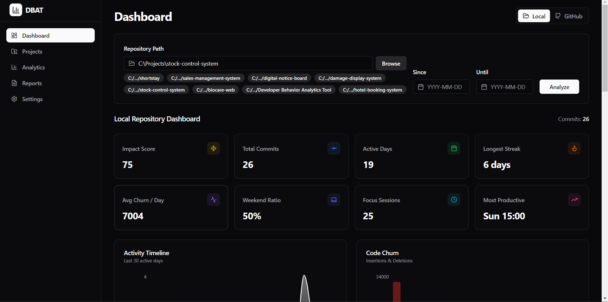
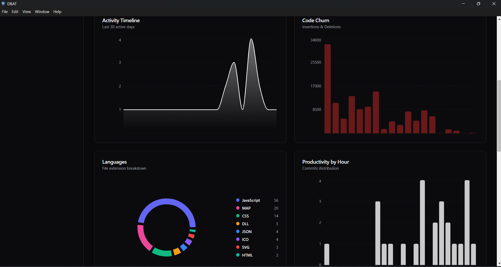
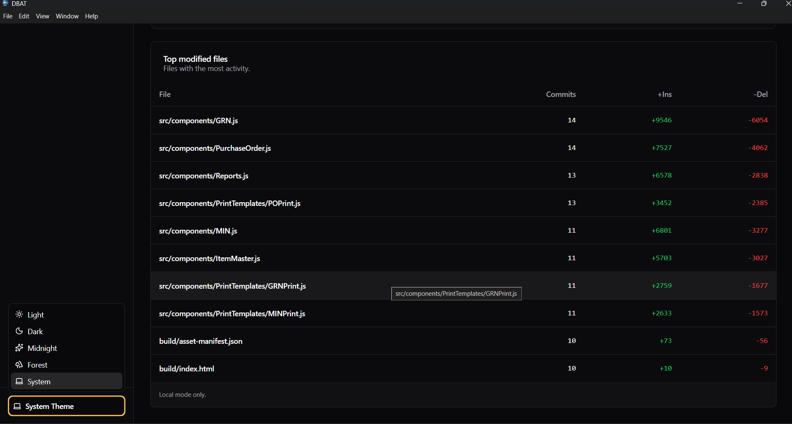
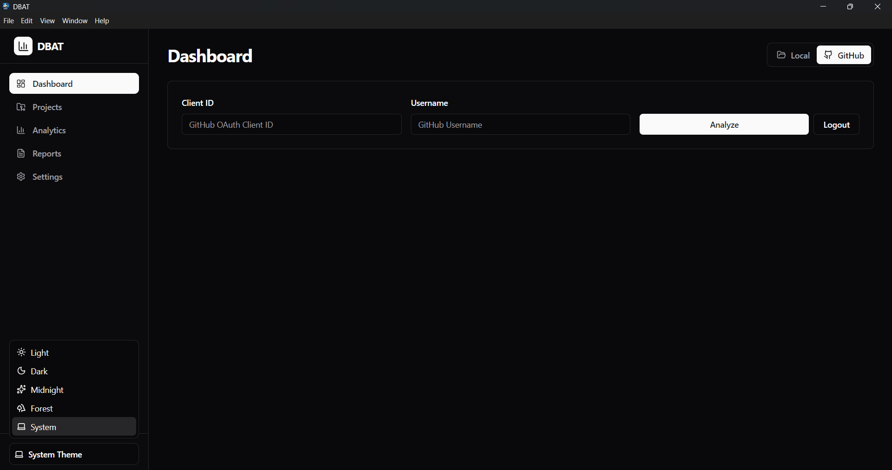

<div align="center">

  
  <h1>Developer Behavior Analytics Tool (DBAT)</h1>
  
  <p>
    An advanced developer productivity and behavior analysis tool built with Electron, React, and TypeScript.
  </p>
  
  
<!-- Badges -->
<p>
  <a href="https://github.com/kspeiris/Developer-Behavior-Analytics-Tool/graphs/contributors">
    
  </a>
  <a href="">
    
  </a>
  <a href="https://github.com/kspeiris/Developer-Behavior-Analytics-Tool/network/members">
    
  </a>
  <a href="https://github.com/kspeiris/Developer-Behavior-Analytics-Tool/stargazers">
    
  </a>
  <a href="https://github.com/kspeiris/Developer-Behavior-Analytics-Tool/issues/">
    
  </a>
  <a href="https://github.com/kspeiris/Developer-Behavior-Analytics-Tool/blob/master/LICENSE">
    
  </a>
</p>
   
<h4>
    <a href="https://github.com/kspeiris/Developer-Behavior-Analytics-Tool/">View Demo</a>
  <span> · </span>
    <a href="https://github.com/kspeiris/Developer-Behavior-Analytics-Tool">Documentation</a>
  <span> · </span>
    <a href="https://github.com/kspeiris/Developer-Behavior-Analytics-Tool/issues/">Report Bug</a>
  <span> · </span>
    <a href="https://github.com/kspeiris/Developer-Behavior-Analytics-Tool/issues/">Request Feature</a>
  </h4>
</div>

<br />


<!-- Table of Contents -->
# :notebook_with_decorative_cover: Table of Contents

- [About the Project](#star2-about-the-project)
  - [Screenshots](#camera-screenshots)
  - [Tech Stack](#space_invader-tech-stack)
  - [Features](#dart-features)
- [Getting Started](#toolbox-getting-started)
  - [Prerequisites](#bangbang-prerequisites)
  - [Installation](#gear-installation)
  - [Run Locally](#running-run-locally)
- [Usage](#eyes-usage)
- [Roadmap](#compass-roadmap)
- [Contributing](#wave-contributing)
- [License](#warning-license)
- [Contact](#handshake-contact)
- [Acknowledgements](#gem-acknowledgements)

---

# :star2: About the Project

**DBAT (Developer Behavior Analytics Tool)** is a cross-platform desktop application designed to provide developers and managers with deep insights into coding habits, project activity, and repository health. 

By analyzing local Git repositories and GitHub account data, DBAT visualizes key metrics such as commit frequency, code churn, and engagement scores, helping teams identify bottlenecks and celebrate productivity.

## :camera: Screenshots







## :space_invader: Tech Stack

<details>
  <summary>Client</summary>
  <ul>
    <li><a href="https://reactjs.org/">React.js</a></li>
    <li><a href="https://www.typescriptlang.org/">TypeScript</a></li>
    <li><a href="https://tailwindcss.com/">TailwindCSS</a></li>
    <li><a href="https://vitejs.dev/">Vite</a></li>
    <li><a href="https://lucide.dev/">Lucide React</a></li>
    <li><a href="https://recharts.org/">Recharts</a></li>
  </ul>
</details>

<details>
  <summary>Desktop Wrapper</summary>
  <ul>
    <li><a href="https://www.electronjs.org/">Electron</a></li>
    <li><a href="https://www.electron.build/">Electron Builder</a></li>
  </ul>
</details>

<details>
  <summary>Database & Backend Logic</summary>
  <ul>
    <li><a href="https://github.com/WiseLibs/better-sqlite3">Better-sqlite3</a></li>
    <li><a href="https://nodejs.org/">Node.js</a></li>
  </ul>
</details>

## :dart: Features

- **Dual Mode Analysis**: 
  - **Local Mode**: Analyze any git repository on your machine instantly.
  - **GitHub Mode**: Connect your GitHub account via OAuth to analyze remote activity and engagement.
- **Interactive Dashboard**: Visual KPIs including total commits, active days, and code churn metrics.
- **Activity Charts**: visualizing commit history over time.
- **Top Files Analysis**: Identify which files are modified most frequently (hotspots).
- **Export Capabilities**: Generate comprehensive Markdown reports of your analysis.
- **Project History**: Quickly switch between recently analyzed repositories.
- **Secure Authentication**: Safe GitHub login integration.

---

# :toolbox: Getting Started

Follow these steps to get a local copy up and running.

## :bangbang: Prerequisites

This project requires Node.js and npm to be installed on your machine.
- [Node.js](https://nodejs.org/en/download/) (v16+)
- npm

```bash
npm install npm@latest -g
```

## :gear: Installation

1. Clone the repository:
   ```bash
   git clone https://github.com/kspeiris/Developer-Behavior-Analytics-Tool.git
   ```

2. Navigate to the project directory:
   ```bash
   cd Developer-Behavior-Analytics-Tool
   ```

3. Install dependencies:
   ```bash
   npm install
   ```

## :running: Run Locally

To start the application in development mode with hot-reloading:

```bash
npm run dev
```
> This will start the Vite dev server and launch the Electron window.

To build the application for production:

```bash
npm run build
```

To package the application (create an executable):

```bash
npm run dist
```

---

# :eyes: Usage

### Local Repository Analysis
1. Launch the application.
2. Select **Local** mode from the dashboard toggle.
3. Click **Browse** to select a folder containing a `.git` repository.
4. (Optional) Set a date range for the analysis.
5. Click **Analyze**.
6. View the generated dashboard with commit statistics and file activity.

### GitHub Account Analysis
1. Select **GitHub** mode.
2. Enter your **Client ID** (for OAuth App) and **Username**.
3. Click **Login** to authenticate securely with GitHub.
4. Once authenticated, click **Analyze** to fetch and visualize account data.

### Exporting Reports
1. Run an analysis in either mode.
2. Navigate to the **Reports** tab via the UI (if available) or look for the export button.
3. Click **Export Markdown Report** to save a summary of your data.

---

# :compass: Roadmap

- [x] Local Git Repository Analysis
- [x] GitHub Account Integration
- [x] Interactive Charts & Dashboard
- [ ] Comparison between multiple repositories
- [ ] Team/Organization level analytics
- [ ] PDF Export support
- [ ] Custom date range presets

---

# :wave: Contributing

Contributions are what make the open source community such an amazing place to learn, inspire, and create. Any contributions you make are **greatly appreciated**.

1. Fork the Project
2. Create your Feature Branch (`git checkout -b feature/AmazingFeature`)
3. Commit your Changes (`git commit -m 'Add some AmazingFeature'`)
4. Push to the Branch (`git push origin feature/AmazingFeature`)
5. Open a Pull Request

---

# :warning: License

Distributed under the MIT License. See `LICENSE` for more information.

---

# :handshake: Contact

Kavindu Peiris - [GitHub Profile](https://github.com/kspeiris)

Project Link: [https://github.com/kspeiris/Developer-Behavior-Analytics-Tool](https://github.com/kspeiris/Developer-Behavior-Analytics-Tool)

---

# :gem: Acknowledgements

- [Shields.io](https://shields.io/)
- [React Icons](https://react-icons.github.io/react-icons/)
- [Shadcn UI](https://ui.shadcn.com/)
- [Vite Electron Builder](https://github.com/electron-vite/electron-vite-react)


