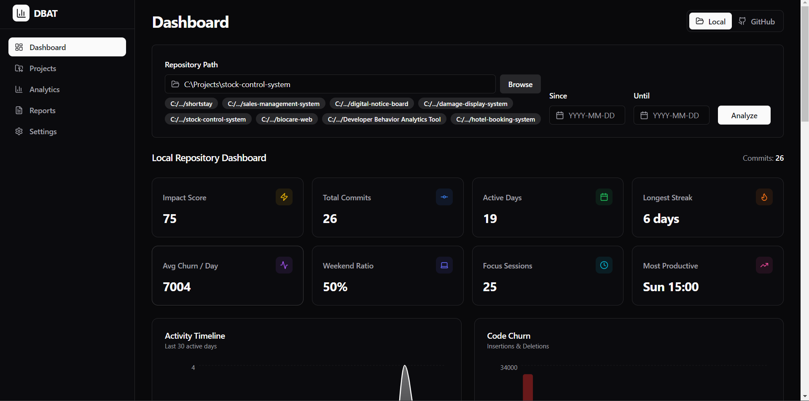
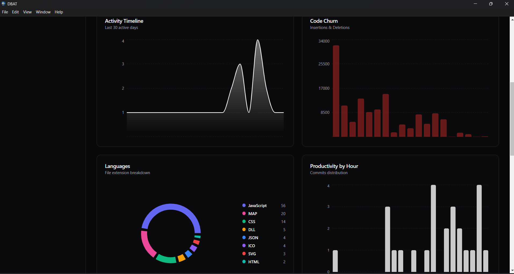
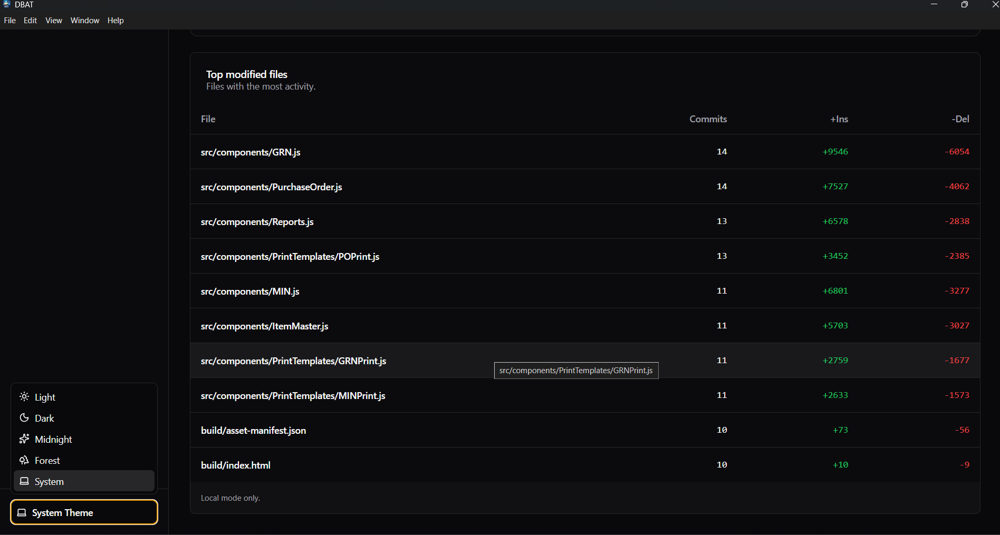
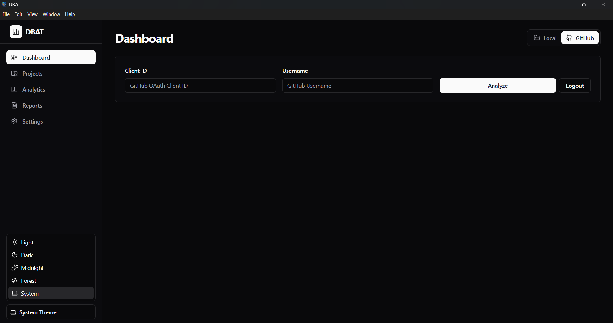

<div align="center">
  
  <h1>Developer Behavior Analytics Tool</h1>
  <p>Desktop analytics for local Git repositories and GitHub activity.</p>

  <p>
    <a href="https://github.com/kspeiris/Developer-Behavior-Analytics-Tool/graphs/contributors">
      
    </a>
    <a href="https://github.com/kspeiris/Developer-Behavior-Analytics-Tool/commits/main">
      
    </a>
    <a href="https://github.com/kspeiris/Developer-Behavior-Analytics-Tool/network/members">
      
    </a>
    <a href="https://github.com/kspeiris/Developer-Behavior-Analytics-Tool/stargazers">
      
    </a>
    <a href="https://github.com/kspeiris/Developer-Behavior-Analytics-Tool/issues">
      
    </a>
    <a href="https://github.com/kspeiris/Developer-Behavior-Analytics-Tool/blob/main/LICENSE">
      
    </a>
  </p>
</div>

System build: https://drive.google.com/file/d/1F3r6xgSdaQ0aMJjVSMTh2bYd5bD9sg4h/view?usp=sharing


## Table of Contents

- [About](#about)
- [Screenshots](#screenshots)
- [Tech Stack](#tech-stack)
- [Features](#features)
- [Getting Started](#getting-started)
- [Usage](#usage)
- [Roadmap](#roadmap)
- [Contributing](#contributing)
- [License](#license)
- [Contact](#contact)

## About

DBAT is a desktop application for analyzing developer activity from local Git repositories and GitHub accounts. It helps surface commit patterns, code churn, active days, hotspots, and other productivity signals in a single interface.

## Screenshots






## Tech Stack

- React
- TypeScript
- Vite
- Electron
- Tailwind CSS
- Recharts
- better-sqlite3

## Features

- Local repository analysis
- GitHub account analysis
- Dashboard cards and charts
- Top modified files and churn tracking
- Markdown report export
- Saved projects
- Recent repository history

## Getting Started

### Prerequisites

- Node.js 18 or newer
- npm

### Installation

```bash
git clone https://github.com/kspeiris/Developer-Behavior-Analytics-Tool.git
cd Developer-Behavior-Analytics-Tool
npm install
```

### Run in Development

```bash
npm run dev
```

This starts Vite, watches the Electron files, and launches the Electron app.

### Build the App

```bash
npm run build
```

### Run the Built App

```bash
npm run start
```

### Package the App

```bash
npm run pack
```

To create an installer:

```bash
npm run dist
```

## Usage

### Local Repository Analysis

1. Open the app.
2. Choose `Local`.
3. Browse to a folder that contains a `.git` directory.
4. Optionally set `Since` and `Until`.
5. Click `Analyze`.

### GitHub Analysis

1. Choose `GitHub`.
2. Enter your GitHub OAuth app client ID.
3. Enter the GitHub username to analyze.
4. Complete login.
5. Click `Analyze`.

### Reports

1. Run an analysis.
2. Open the `Reports` view.
3. Export the current results as Markdown.

## Roadmap

- [x] Local Git repository analysis
- [x] GitHub account integration
- [x] Dashboard and charts
- [ ] Multi-repository comparison
- [ ] Team or organization analytics
- [ ] PDF export
- [ ] Preset date ranges

## Contributing

1. Fork the repository.
2. Create a branch.
3. Make your changes.
4. Commit and push.
5. Open a pull request.

## License

This project is licensed under the MIT License.

## Contact

Kavindu Peiris  
GitHub: https://github.com/kspeiris

Project: https://github.com/kspeiris/Developer-Behavior-Analytics-Tool
